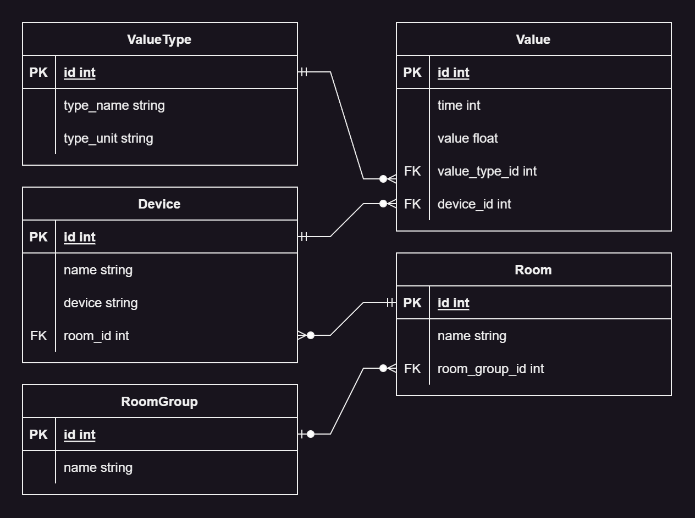

# Documentation

## File Structure

```
workspace
|-- api     Code of the backend api
|-- gui     Fontend Code
|-- logs    Various logs of the application
```

For each section the corresponding directory will be explained in 
detail.

## Debugging & Logs

When the api is running, the application is writing logs in the 
**workspace/logs** folder. There are logs of nginx, the gui and the 
api itself.

The usful logs are explained below:

### api.run.log

In this file errors originating from the api will be displayed.

Here, infos about FastAPI, sqlalchemy or infos that are logged manually are saved.
If you want to log your own info or own erros, you can do this in **main.py**:

```python
logger.debug("debug")
logger.info("info")
logger.warn("warning")
logger.error("error")
```

**CAUTION**

If you don't find your logged messages, thats maybe because the 
displayed log level is not set to the appropiate level. You can take a 
way around this by logging at a higher level:

```
logger.info("")
```
becomes to
```
logger.error("")
```

**More about errors that occur in the api will be described in the API section.**

### gui.run.log

This log will give you info about the vite dev server that runs the gui.
If the gui isn't running, you will see it here.

If the last message in the log looks like this...
```log
> rdp@0.0.0 dev
> vite


  VITE v4.4.9  ready in 1237 ms

  ➜  Local:   http://localhost:5173/
  ➜  Network: use --host to expose
```
... then it should mean that the dev server is running correctly. Sometimes
there will be some warnings printed below the message shown above.
But this shouldn't be any problem.

**INFO** If a message is displayed that looks likte this: _vite not found_,
probably means that the dependencies are not installed.

To fix this, navigate in the container to the gui folder and enter this command:
```bash
abc@4069ff6a4615:~/workspace$ cd gui
abc@4069ff6a4615:~/workspace/gui$ npm i
```
After this the dependecies should be installed and the server will be running again.

### nginx_error.log

```log
2023/11/22 13:41:57 [error] 104#104: *174 connect() failed (111: Unknown error) while connecting to upstream, client: ...
```

If you see this sort of error, it propably means that the gui dev server isn't
running and thus nginx can't connect to it

## API

### File Structure

Here is a representation of the file structure of the api code:
```
api
|-- rdp
|   |-- api    
|   |   |-- __init__.py    
|   |   |-- api_types.py    REST API pydantic model definitions    
|   |   |-- main.py         API Endpoint definitions 
|   |-- crud    
|   |   |-- __init__.py    
|   |   |-- crud.py         Crud operations on database
|   |   |-- engine.py       Helper function for database engine
|   |   |-- model.py        Database ORM Model definitions
|   |-- sensor   
|   |   |-- __init__.py    
|   |   |-- reader.py       Class defintion for reading devices
|   |-- __init__.py   
```

### REST API

API Endpoints are defined in _api/rdp/api/main.py_ like so:
```python
@app.put("/device/{id}/")
def put_device(id, device: ApiTypes.DeviceNoID) -> ApiTypes.Device:
    """PUT device: Add device or update device of id.

    Args:
        id int: device id

    Raises:
        HTTPException

    Returns:
        ApiTypes.Device: A device in the database.

    """
    global crud
    try:
        device = crud.add_or_update_device(
            id, device_device=device.device, device_name=device.name
        )
        return get_device(device.id)
    except crud.NoResultFound:
        raise HTTPException(status_code=404, detail="Item not found")
    except crud.IntegrityError as e:
        raise HTTPException(
            status_code=400,
        )
```

Step by Step

With `@app.put(path)` you can tell FastAPI that the following function should act as an
endpoint for a PUT request at the url _/device/:id_ where _id_ is an id for a
device in the database
```python
@app.put("/device/{id}/")
```

The `id` will take the value of the _id_ in the url.

`device` will be the body of the request.

And `-> ApiTypes.Device` will tell FastAPI that this function will return a Device
object
```python
@app.put("/device/{id}/")
def put_device(id, device: ApiTypes.DeviceNoID) -> ApiTypes.Device:
```

### CRUD

#### Data model



**ValueType** gives info of which unit a value has.
- type_name: The name of the type
- type_unit: The unit of the type

**Value** is a measurement of a device.
- time: The time of measurement in unix time format
- value: A floating point value
- value_type_id: Foreign key to ValueType
- device_id: Foreign key to Device

**Device** represents a real device in a location that reads values
- name: Name of device
- device: The location of the device file of a unix system
- room_id: Foreign key to Room in which the device is located

**Room**
- name: Name of Room
- room_group_id: Foreign key to RoomGroup

**RoomGroup** groups multiple room logically
- name: Name of room group

#### Sqlalchemy

Sqlalchemy is an ORM for python, it is a database abstraction.

For this application, all tables are defined with sqlalchemy in
_api/rdp/crud/model.py_

How to define a table with sqlalchemy:
```python
class Device(Base):
    __tablename__ = "device"
    id: Mapped[int] = mapped_column(primary_key=True)
    name: Mapped[str]
    device: Mapped[str]
    room_id: Mapped[int] = mapped_column(ForeignKey("room.id"), nullable=True)

    room: Mapped["Room"] = relationship(back_populates="devices")
    values: Mapped[List["Value"]] = relationship(
        back_populates="device", cascade="all, delete-orphan"
    )

    __table_args__ = (UniqueConstraint("device", name="device integrity"),)
```

**__tablename__** defines the table name

**Mapped[type]** will map the member variable of the python object to an field in 
the database:
```python
name: Mapped[str]
```
With **mapped_column()** you can give some args to the field:
```python
id: Mapped[int] = mapped_column(primary_key=True)
```

There are multiple ways to define relations but for all features you can do this:
```python
room_id: Mapped[int] = mapped_column(ForeignKey("room.id"), nullable=True)

room: Mapped["Room"] = relationship(back_populates="devices")
values: Mapped[List["Value"]] = relationship(
    back_populates="device", cascade="all, delete-orphan"
)
```

**room_id** will be the foreign key in your database

**room** will be the python object representing the parent table.
The `back_populates` option will reference the children member in the
parent object. Much like **values** that represents the children python objects

With **__table_args__** you can set additional arguments for the table like
an unique constraint.

### Sensor

The sensor class reads all devices from the database, loop through
them, read the values from the devices and save the values back to the
database.

A sensor object will be initialized in _api/rdp/api/main.py_:
```python
@app.on_event("startup")
async def startup_event() -> None:
    logger.info("STARTUP: Sensor reader!")
    global reader, crud
    # ...
    reader = Reader(crud)
    reader.start()
    logger.debug("STARTUP: Sensor reader completed!")
```